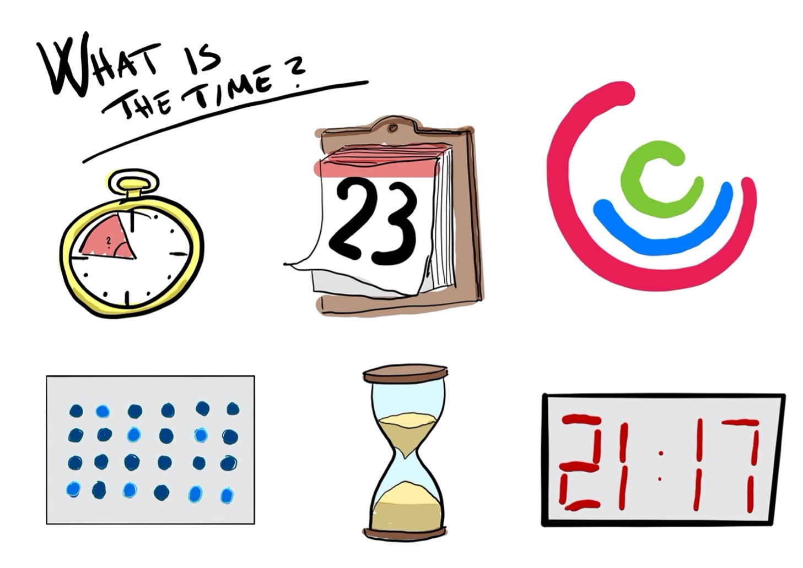

# Undervisningsplan for Programmering B
_Underviser: Jeppe Veirum Larsen_

*Hold: Game Design / Robotteknologi*

⚠️ **Fravær:** Der checkes fravær ved timens start, hvis man ikke er til stede ved registrering får man 100% fravær. Det ændres ikke igen. Hvis man af den ene eller anden grund skal forlade undervisningen, skal i orientere jeres lærer. Hvis i forlader undervisningen før den er afsluttet får i også fravær. I er velkommen til at skrive noter på fraværet i lectio.

#### Ikoner

For at gøre det lettere at finde rundt i dokument, bruger jeg forskellige ikoner, som er beskrevet nedenfor.

> 📚 Materiale i skal læse
>
> ✏️ Opgave i skal løse
>
> ⚠️ Vigtigt, noget i skal være opmærksom på
>
> ⛔️ Advarsel, noget i ikke skal gøre
>
> 🔗 Link, ud af dokumentet

#### 🔗 Nyttige links

Her er lidt forskellige links som i kommer til at bruge gennem alle 3 år af undervisningen. Listen vil blive udbygget som vi kommer frem.

> [Læreplan Programmering B](https://www.uvm.dk/-/media/filer/uvm/gym-laereplaner-2017/valgfag/programmering-b-valgfag-august-2017.pdf)
>
> [P5.js](https://p5js.org)
>
> [The Coding Train](https://www.youtube.com/channel/UCvjgXvBlbQiydffZU7m1_aw)
>
> [Github](https://github.com)

## 16/11 2021 - Velkommen til Programmeinrg B

*2 Moduler*

Velkomst. Introduktion til Pro B. og gennemgang af læreplan samt en kort snak om hvad er programmering, hvad er data og hvad kommer vil igennem i løbet af faget.

✏️ **Opgaver**

- Opret en bruger på p5.js

- Opret en bruger på Github

- Organiser jeres Logbog f.eks. i Noter, Opgaver og dokumentation
- Se Intro, 1.1 og 1.2 i *The Coding Trains* Code! Playliste

📚 **Materiale**

🎥 [The Coding Train - Code!](https://www.youtube.com/watch?v=HerCR8bw_GE&list=PLRqwX-V7Uu6Zy51Q-x9tMWIv9cueOFTFA)

## 29/11 2021 - Forløbet Kalenderlys

2 Moduler

Vi starter i dag på forløbet Juledekoration hvor vi begynder at stufte lidt bekendskab med de mest basale koncepter inden for programmering.

✏️ **Opgaver**

- Begynd på forløbet
- Opdater din logbog på OneNote()

📚 **Materiale**

[Link til beskrivelse af forløb og opgaven.](https://github.com/veirum/pro-c/blob/master/Forløb/Kaldenderlys.md)

## 7/1 2022 - Forløbet Generative Art
 

Vi starter her efter ferien med forløbet generative art. Forløbet består af en bunden opgave efterfulgt af en fri opgave med tilhørende fernisering af jeres computer genererede kunst.

Følg dette link [10-Print](https://github.com/veirum/pro-c/blob/master/Forløb/10_print.md)

## 15/3 2022 - Forløbet Ur

Tid er et vigtig aspekt ligemeget om man udvikler robotter, spil eller andre programmer. 

## 5/4 2022 Bruger interaktion

*2 moduler*

Nu har vi arbejdet med computeren og hvordan vi kan få output i forskellige former fra vores program gennem kalenderlys, kunst og ure.

Det næste vi skal kigge lidt på er bruger interaktion og hvordan vi kan få vores programmer til at reagere på brugerens interaktion ved hjælp af diverse input ved hjælp af mus og keyboard. 

### Mouse Interaction

Hvor er musen?

MouseX og Mouse Y

27/4

2

29/4

2

2/5

2

11/5

2

20/5

1

24/5

3
